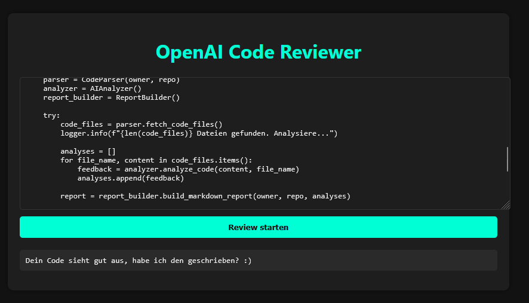

# OpenAI Code Reviewer

  

Ein **AI Code Reviewer**, der GitHub-Repositories analysiert, den Code auf Qualität prüft und über OpenAI GPT-4 Vorschläge sowie Zusammenfassungen liefert. Das Projekt besteht aus einem **Backend** (FastAPI) und einem **Frontend** (Dark Theme) für einfache Interaktion.

## Screenshot



---

## Features

* Analysiert GitHub-Repositories auf Codequalität
* Generiert präzise Zusammenfassungen des Codes mit OpenAI GPT-4
* Modernes, dunkles Web-Frontend für Benutzerinteraktion
* REST API über FastAPI
* Docker-Setup für einfache Bereitstellung

---

## 🚀 Installation (lokal)

1. Repository klonen:

   ```bash
   git clone https://github.com/<dein-username>/<repo-name>.git
   cd <repo-name>
   ```

2. Python Virtual Environment erstellen:

   ```bash
   python -m venv venv
   source venv/bin/activate  # Linux/Mac
   venv\Scripts\activate     # Windows
   ```

3. Dependencies installieren:

   ```bash
   pip install -r requirements.txt
   ```

4. `.env` Datei erstellen und den OpenAI API-Key einfügen:

   ```env
   OPENAI_API_KEY=dein_api_key
   ```

5. Backend starten:

   ```bash
   uvicorn src.main:app --reload --host 0.0.0.0 --port 8000
   ```

6. Frontend öffnen:

   * Im Browser `http://localhost:8080` aufrufen

---

## 🐳 Mit Docker

Das Projekt kann mit Docker Compose gestartet werden:

```bash
docker compose up --build
```

* Backend läuft auf `http://localhost:8000`
* Frontend läuft auf `http://localhost:8080`

---

## 💻 Nutzung

1. Code im Frontend eingeben oder kopieren
2. Auf **Review** klicken
3. Backend sendet den Text an OpenAI GPT-4 und zeigt die Zusammenfassung / den Feedback-Report an

Beispiel API-Aufruf (Postman oder Fetch):

```http
POST /api/summarize/
Content-Type: application/json

{
  "text": "Hier steht dein Code oder Text"
}
```

Antwort:

```json
{
  "summary": "Prägnante Zusammenfassung des Codes"
}
```

---

## ⚠ Hinweise

* Ein gültiger **OpenAI API-Key** ist notwendig
* Eventuell fallen API-Kosten bei OpenAI an
* `.env` darf **nicht** ins GitHub-Repository hochgeladen werden

---

## 📂 Projektstruktur

```
openai-code-reviewer/
│
├─ frontend/           # HTML, CSS, JS für das Dark Theme Frontend
├─ src/                # Python Backend-Code
│  ├─ routers/
│  │   └─ summarize_router.py
│  ├─ main.py
│  └─ ...
├─ Dockerfile.backend
├─ Dockerfile.frontend
├─ docker-compose.yml
├─ requirements.txt
└─ README.md
```

---

## 🎨 Frontend

* Dunkles Theme für angenehme Nutzung
* Einfacher Eingabebereich und „Review“ Button
* Zeigt Zusammenfassung / Feedback direkt an
* Keine Installation notwendig, läuft direkt im Browser

---

## 📌 License

MIT License

---

## 🙏 Credits

* OpenAI GPT-4 für Code-Analyse und Text-Zusammenfassung
* FastAPI für das Backend
* Nginx für Frontend Hosting
